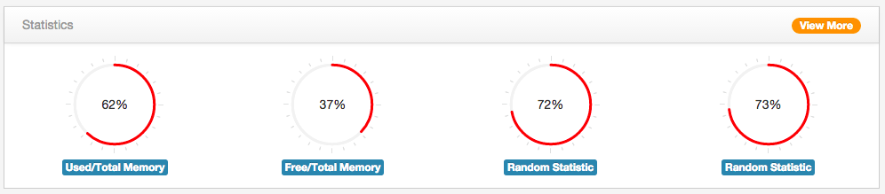
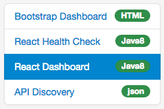
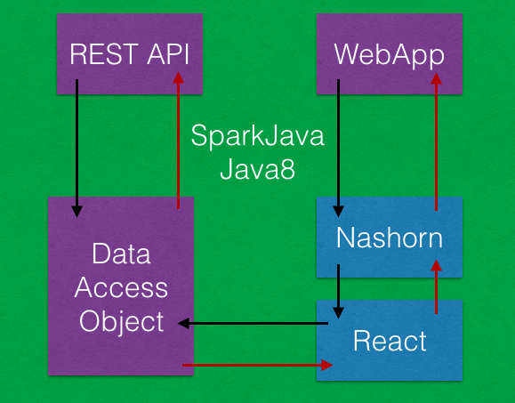

# SparkJava Retrofit React Demonstration

> ___A Java 8 web application using lightweight frameworks and [ReactJS](https://facebook.github.io/react/) for the UI___


## Basic Idea

A Java 8 process with an embedded rest-api and web application, where the web application user interface is constructed using the React JavaScript components via the Nashorn engine with access to Java services.


## Dependencies

SparkJava and Guava keep the overall dependencies lightweight (not even a single spring library here).


* **[SparkJava](http://sparkjava.com/)** - A minimalist Java 8 web application framework
* **[Retrofit](http://square.github.io/retrofit/)** - A type-safe REST client for Java
* **[ReactJS](http://facebook.github.io/react/)** - A Javascript library for building user interfaces
* **[Bootstrap-Admin-Theme](https://github.com/VinceG/Bootstrap-Admin-Theme)** - A web dashboard courtesy of Vincent Gabriel
* **[JMustache](https://github.com/samskivert/jmustache)** - A Java template engine

Also using **[Quava](https://code.google.com/p/guava-libraries/)** and a choice of **[Gradle](http://gradle)** or **[Maven](http://maven.apache.org)** for Java builds.


## Taking it for a spin

Make sure you have `JDK 1.8.0_05-b13` or above.

command | description
--------|------------
`gradle build` | to compile and run the tests
`mvn clean install` | to compile and run the tests
`grunt watch` | compile jsx into js resource (from `src/main/jsx` into `src/main/js`)
[`DemoService`](src/main/java/me/roybailey/http/DemoService.java) | Start Web Application [http://localhost:4545](http://localhost:4545)

Alternatively run the `gradle installApp` command to create a runnable distribution package in `build/install/sparkjava-retrofit-react` and run the appropriate script in the `bin` folder.

> These dials are using a JavaScript charting library but are rendered using ReactJS with data from Java:



> These tables are rendered using ReactJS with data from Java, one table uses a Java service with direct access to the data store, the other Java service calls the rest-api from within Java to obtain the same data:


_the `?skip=2&limit=4` parameters on the request URL are passed into ReactJS and back to Java services_


## License

[`MIT license`](LICENSE)


## Overview

##### The REST api

The rest-api provides a simple (yet richer than the usual todo list) [`task`](src/main/java/me/roybailey/model/Task.java) data model encapsulated behind a [TaskService interface](src/main/java/me/roybailey/service/TaskService.java) (the typical Data-Access-Object pattern).  For the purpose of this exercise the tasks are seeded from a small sample of data and kept in-memory.  There are only a couple of read operations defined as the main focus is to render data.  However, this Data-Access-Object implementation could be swapped out for any Java based database or messaging connection and enriched to include fully functional CRUD (create, read, update, delete) functionality.

> See [`RestfulController`](src/main/java/me/roybailey/http/RestfulController.java)


##### The User Interface

The first version of [Bootstrap-Admin-Theme](https://github.com/VinceG/Bootstrap-Admin-Theme) is purely a static copy of the original with the dashboard sidebar changed to provide the menu of demonstration links.  Useful for showing how rich static content can be rendered easily with [SparkJava](http://sparkjava.com/).



The second version is the [Dashboard content rendered by ReactJS](src/main/jsx/dashboard.jsx), with a [minimal HTML template](src/main/resources/webapp/assets/dashboard.html) to keep the surrounding page `<script>` and `<head>` tags separate.


##### Setting up Nashorn with ReactJS

**[Npm](https://www.npmjs.com/)** is used to download JavaScript packages.  **[Grunt](http://gruntjs.com/)** is used to compile `jsx` and to create a ***bundle.js*** of all Javascript needed for Nashorn.  This keeps the Java Nashorn loading code simple.

> Java to setup Nashorn

```Java
        nashorn = (NashornScriptEngine) new ScriptEngineManager().getEngineByName("nashorn");
		...
        Bindings bindings = new SimpleBindings();
        bindings.put("JavaTaskService", taskService);
        nashorn.setBindings(bindings, ScriptContext.GLOBAL_SCOPE);
        ...
        nashorn.eval(new InputStreamReader(this.getClass().getResourceAsStream("/webapp/bundle.min.js")));
```

There are three steps above:

1. Create the Nashorn JavaScript engine instance
1. Inject any Java services you want your JavaScript to access
1. Load the pre-created bundle.js

Creating the Nashorn engine instance is simple enough, although there is a little bit of [nashorn-polyfill](src/main/js/nashorn-polyfill.js) to be aware of (this gets included in the bundle.js).

The ability to use 'Dependency Injection' into your JavaScript makes it possible to access any Java services you have while rendering a page.  There may need to be some data type conversions but this is a very powerful option and avoids trying to find JavaScript drivers for everything.

> JavaScript to call back into Java services

```JavaScript
    loadTaskDataFromJavaDirectly: function () {
        return Java.from(JavaTaskService.getTaskList(this.props.skip, this.props.limit));
    },
```

Lastly we leverage `npm` and `grunt` to create a ***bundle.js*** containing ReactJS and any other libraries you wish to have access to.  *Note: this bundle.js is a simple Grunt concatenation bundle using `uglify`, not a `webpack` or `browserify` bundle*.


##### The Flow

Calling the rest-api will perform all operations in Java; the rest-api converts the incoming endpoint into calls to the data-access-object.  However, the web application calls take the following route:

1. `java8` [SparkJava](http://sparkjava.com/) calls a rendering function in the Nashorn JavaScript engine with properties from the Java process (mapped from the request query parameters)
1. `nashorn` starts rendering the component graph using `React.renderToString`
1. `nashorn` calls any Java services for data *at the time of rendering*
1. `java8` service can do anything Java can do and return results to the React component renderer
1. `nashorn` completes and returns the rendered content to `java8`
1. `java8` maps the `title` and `content` into a HTML template and returns the response 




##### Testing

This entire project is one big test so the only unit tests focus on testing the rest-api using [Retrofit](http://square.github.io/retrofit/).  Retrofit allows you to define a simple interface for your rest-api and leave the plumbing up to the Retrofit library.  A real gem!

> Example Java Retrofit RESTful api interface (See [`RestfulService`](src/main/java/me/roybailey/http/RestfulService) for full version)

```Java
public interface RestfulService {

    @GET("/api/v1/tasks")
    RestResponse<List<Task>> getTasks(
            @Query("skip") int skip,
            @Query("limit") int limit
    );
}
```

> Example Java test using [Retrofit](http://square.github.io/retrofit/) (See [`RestfulControllerTest`](src/test/java/me/roybailey/http/RestfulControllerTest))

```Java
    RestAdapter restAdapter = new RestAdapter.Builder()
                .setEndpoint("http://localhost:4545")
                .build();
    RestfulService taskService = restAdapter.create(RestfulService.class);
    RestResponse<List<Task>> response = taskService.getTasks(1,4);
    List<Task> tasks = response.content;
```


This project was built and tested on a Mac laptop, using Chrome, with `JDK 1.8.0_05-b13`.  It has not been tested/built on any Windows or Linux platforms but should work providing you have a Java 8 installed.


